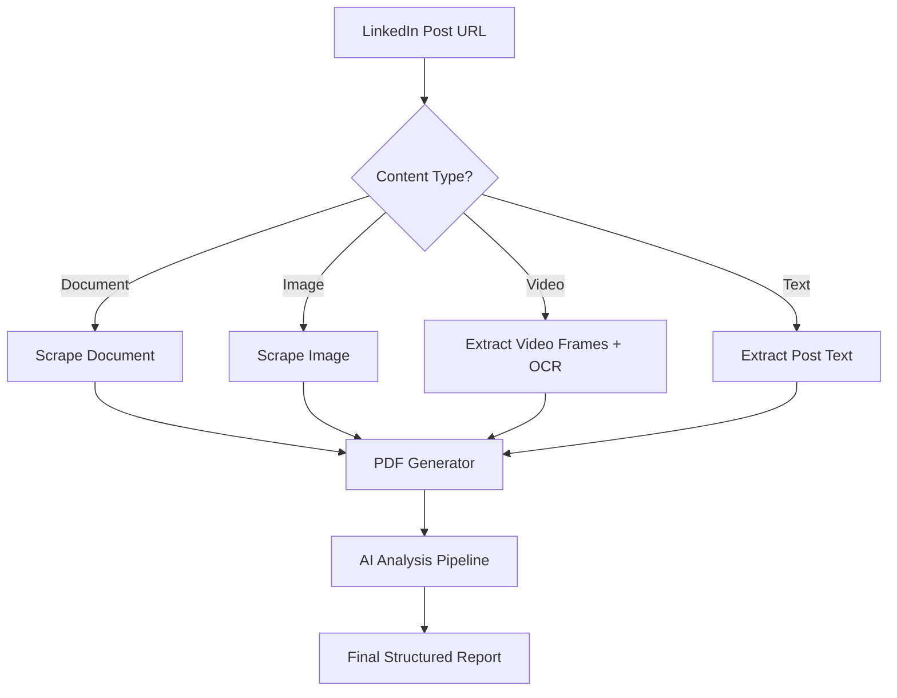
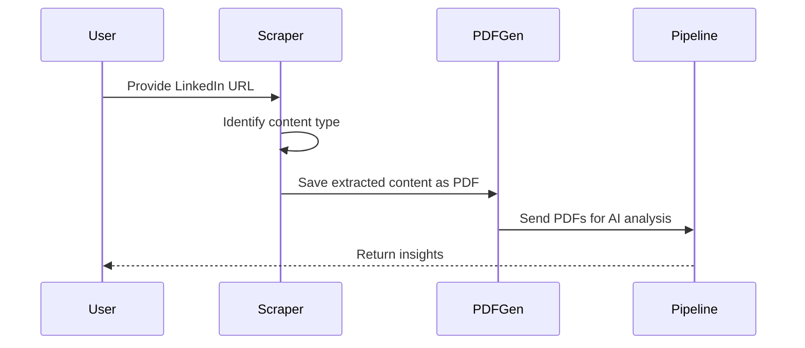
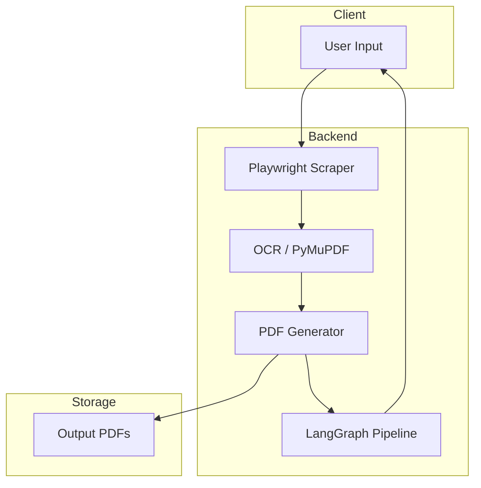
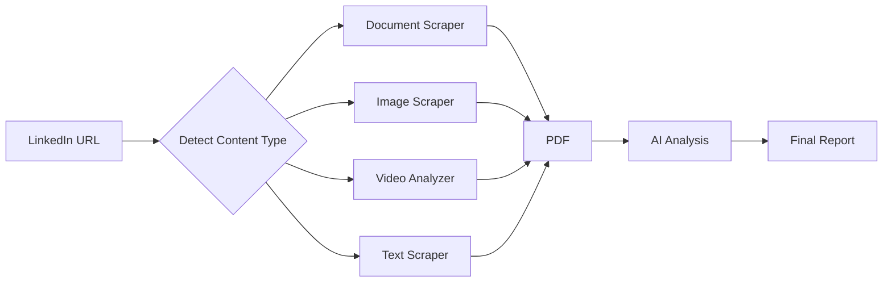

# 📄 LinkedIn Content Scraper & Analyzer

This project automates the process of extracting **documents, images, videos, and text** from LinkedIn posts. It converts them into **structured PDFs** and integrates with an **AI-powered pipeline** for further analysis.

The system uses **Playwright** for LinkedIn scraping, **PyMuPDF & OCR** for document parsing, and **LangGraph** for pipeline orchestration.

---

## 🚀 Features

* ✅ Scrape LinkedIn posts for **documents, images, videos, text**
* ✅ Extract & format **multi-page PDFs**
* ✅ OCR support for scanned/embedded text
* ✅ AI-powered **text & video analysis**
* ✅ Modular **LangGraph pipeline**
* ✅ Error handling & retry logic

---

## 📂 Project Structure

```
project-root/
│── tools/
│   ├── scrape_document.py   # LinkedIn Document Scraper
│   ├── scrape_image.py      # Image Scraper
│   ├── scrape_text.py       # Text Scraper
│   ├── videototext.py       # Video frame + OCR pipeline
│   ├── imagetotext.py       # OCR for images
│
│── pipeline/
│   ├── extractor.py         # LangGraph pipeline definition
│
│── output/
│   ├── *.pdf                # Generated PDFs
│
│── README.md
│── requirements.txt
```

---

## ⚙️ Installation

### 1️⃣ Clone the repo

```bash
git clone https://github.com/jayanth119/automationLinkedin.git
cd automationLinkedin
```

### 2️⃣ Create a virtual environment

```bash
python -m venv venv
source venv/bin/activate   # Mac/Linux
venv\Scripts\activate      # Windows
```

### 3️⃣ Install dependencies

```bash
pip install -r requirements.txt
```

### 4️⃣ Install Playwright browsers

```bash
playwright install
```

---

## 🚀 Usage

Run the LinkedIn pipeline:

```bash
python main.py
```

Or use the **LangGraph pipeline** for AI-powered extraction:

```python
import asyncio
from pipeline.extractor import run_pipeline

asyncio.run(run_pipeline("https://www.linkedin.com/feed/update/..."))
```

---

## 🧩 Tech Stack

* **Python 3.10+**
* **Playwright** – Web scraping
* **ReportLab** – PDF generation
* **PyMuPDF / OCR** – Text extraction
* **LangGraph** – Pipeline orchestration
* **Pandas** – Data handling
* **PIL / OpenCV** – Image & video processing

---

## 📊 Software Diagrams (Mermaid)

### 1. System Flow



---

### 2. Sequence of Operations



---

### 3. Architecture



---

### 4. Data Pipeline



---

## 📌 Future Enhancements

* [ ] Support for **LinkedIn Carousel Posts**
* [ ] Deploy as **FastAPI service**
* [ ] Add **Extention** for reports
* [ ] Extend support for **Twitter & Medium scraping**

---

✨ Built with passion by \[Jayanth chukka] 🚀


